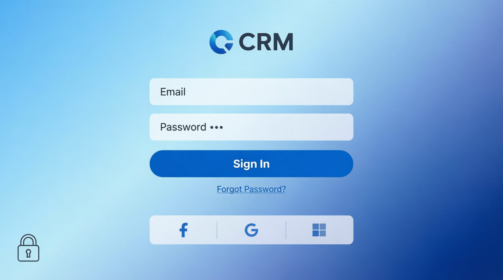
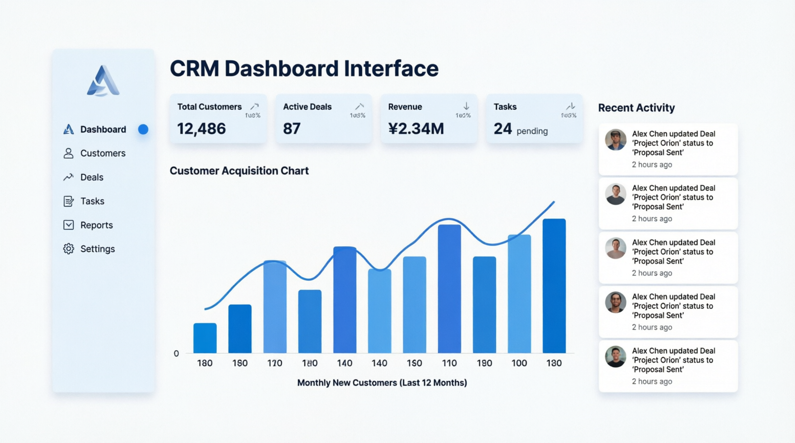
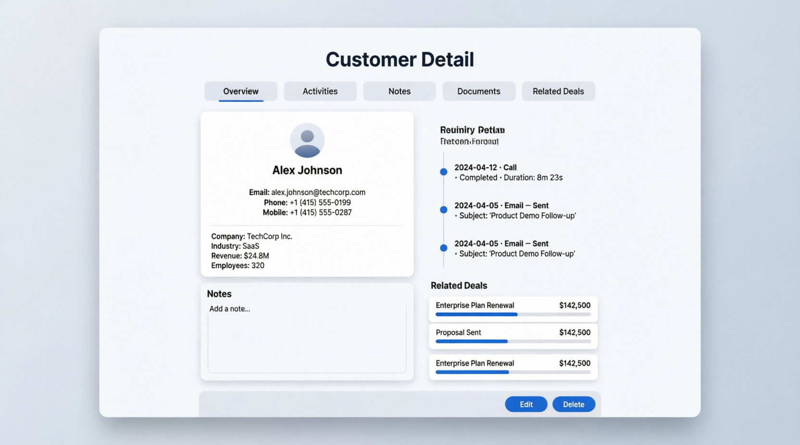
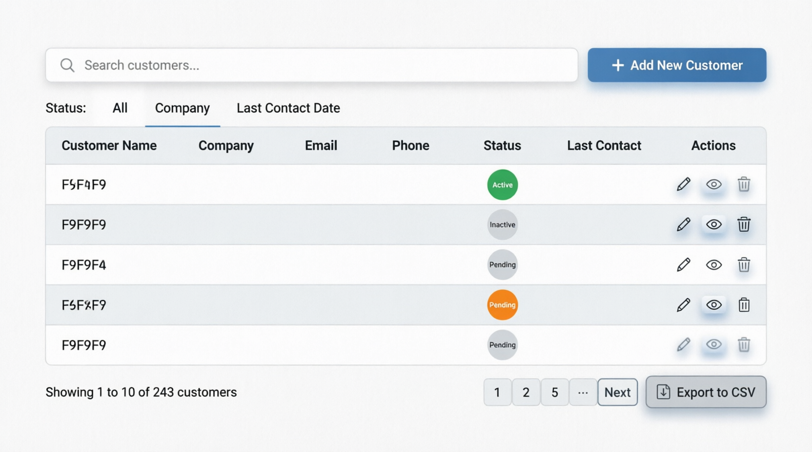
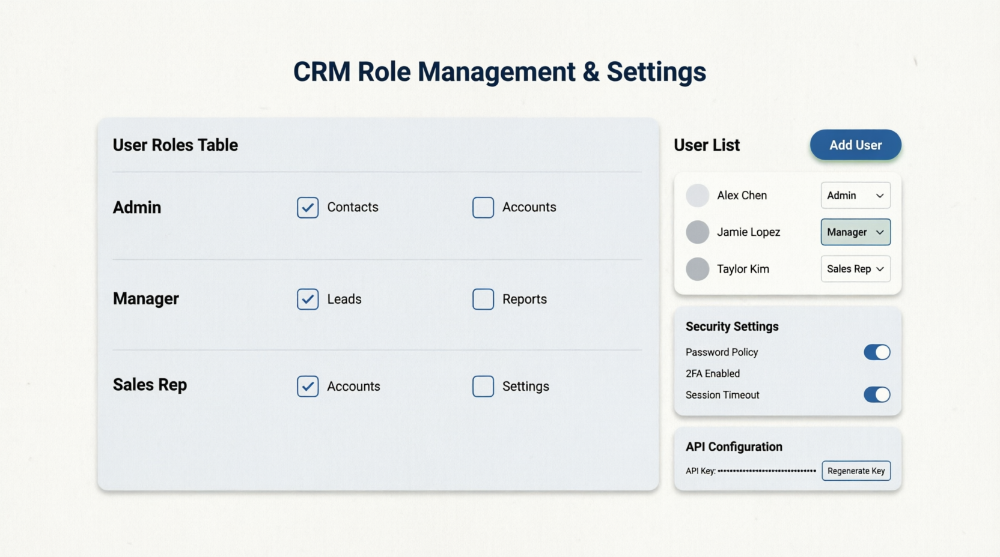
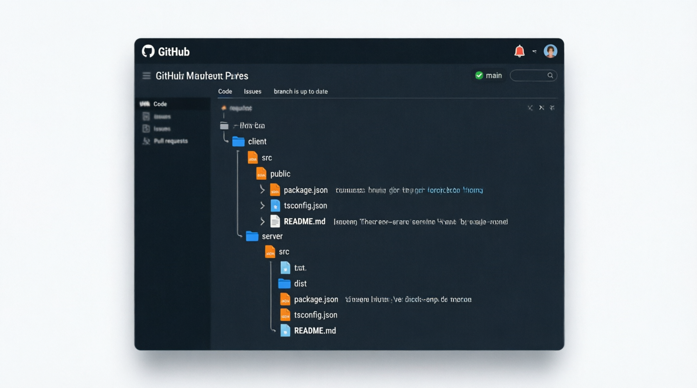

# Enterprise CRM Application

A comprehensive Customer Relationship Management system with role-based access control, secure authentication, and modern UI/UX.

## Screenshot

## 📸 Application UI Screenshots

### 1. Secure Login Interface


### 2. CRM Dashboard & Analytics


### 3. Customer Detail View


### 4. Customer List & Data Table


### 5. Role Management & Security Settings


### 6. Repository Structure


## Features

- **Role-Based Access Control**: Admin, Manager, and Sales Rep roles with granular permissions
- **Secure Authentication**: JWT-based authentication with password hashing
- **Customer Management**: Full CRUD operations for customer records
- **Deal Tracking**: Pipeline management with stage tracking
- **Task Management**: Assignment and tracking of tasks
- **Activity Logging**: Complete audit trail of customer interactions
- **Dashboard Analytics**: Visual metrics and charts
- **API Integration**: RESTful API with secure endpoints
- **Data Synchronization**: Real-time data updates

## Tech Stack

### Frontend
- React 18 with TypeScript
- Vite for fast development
- Tailwind CSS for styling
- React Router for navigation
- Recharts for data visualization
- Axios for API calls

### Backend
- Node.js with Express
- TypeScript
- SQLite database (easily swappable to PostgreSQL)
- JWT authentication
- Helmet for security headers
- CORS support

## Getting Started

### Prerequisites
- Node.js 18+
- npm or yarn

### Installation

1. Clone the repository:
```bash
git clone https://github.com/yourusername/integrated-crm.git
cd integrated-crm